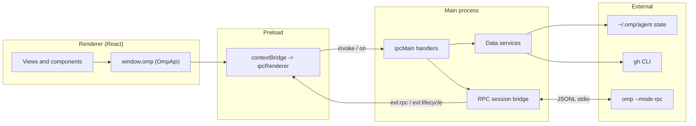

# OMP Studio

A sleek desktop cockpit for the [Oh My Pi (`omp`)](https://github.com/can1357/oh-my-pi)
coding-agent harness — live agent chat, dashboards, and browsers for everything
`omp` knows about, in one native window.

OMP Studio wraps the `omp` command-line harness in an Electron desktop app. It
drives real agent turns over the `omp --mode rpc` protocol, reads your local
`~/.omp/agent` state, and surfaces your GitHub context through the `gh` CLI — so
you can run, inspect, and manage agent work without living in a terminal.

## Features

- **Dashboard** — a single pane that aggregates recent sessions, model and
  provider counts, configured MCP servers, available skills, bundled agents, and
  the current GitHub repository.
- **Live agent chat** — full agent turns over the `omp` RPC protocol, with
  streaming assistant text, thinking blocks, live tool-call rendering, steering,
  and follow-ups, each session backed by its own `omp` child process.
- **Sessions browser** — browse and replay past session transcripts read
  directly from the on-disk `omp` session log.
- **Skills** — discover project, user, and bundled skills with their
  descriptions.
- **MCP servers** — inspect the Model Context Protocol servers configured for
  your user and project.
- **Bundled agents** — explore the task agents shipped with `omp`, including
  their models and spawn relationships.
- **Models / Providers** — review the model catalog and which providers are
  authenticated.
- **GitHub** — view the current repository, its issues and pull requests, and
  your owned repositories.

## Requirements

- **Node.js >= 20**
- **`omp`** installed and authenticated (the harness OMP Studio drives). Verify
  with `omp --version`.
- **`gh`** (GitHub CLI) installed and authenticated for the GitHub features.
  Verify with `gh auth status`.
- **macOS, Linux, or Windows.**

OMP Studio probes the common install locations for `omp` and `gh` (Homebrew,
`~/.bun/bin`, `~/.local/bin`) so it works even when launched as a packaged app
with a minimal `PATH`. Set the `OMP_BINARY` environment variable to override the
`omp` binary location.

## Quick start

```sh
npm install
npm run dev
```

`npm run dev` launches the app in development mode with hot-reloading renderer
and main processes via electron-vite.

## Build

```sh
# Type-check both the node and web TypeScript projects
npm run typecheck

# Bundle main, preload, and renderer into out/
npm run build

# Build distributable installers into release/ (dmg / AppImage / nsis)
npm run dist
```

`npm run dist:mac` targets macOS only. Distributable packaging uses
electron-builder and downloads platform Electron binaries, so it runs locally
or in the release workflow rather than in CI.

## Architecture

OMP Studio follows the standard Electron three-process split. The renderer never
touches Node or Electron directly; it calls a typed `window.omp` bridge that the
preload script exposes, which forwards to `ipcMain` handlers in the main process.
The main process owns the `omp` RPC child processes and all data services.



For the full process model, RPC protocol bridge, data sources, shared type
contract, IPC channel map, and security notes, see
[docs/ARCHITECTURE.md](docs/ARCHITECTURE.md).

## Project layout

```text
omp-studio/
├─ src/
│  ├─ main/                 Electron main process
│  │  ├─ index.ts           App bootstrap, window, IPC registration
│  │  ├─ paths.ts           Binary + omp state path resolution
│  │  ├─ omp/               RPC session bridge + registry
│  │  ├─ services/          Read-only data services (sessions, mcp, ...)
│  │  └─ ipc/               chat.ts + data.ts ipcMain handlers
│  ├─ preload/
│  │  └─ index.ts           Exposes the typed window.omp bridge
│  ├─ renderer/
│  │  ├─ index.html
│  │  └─ src/               React app (views, components, store, lib)
│  └─ shared/               Frozen cross-process contract
│     ├─ ipc.ts             Channel map (CH) + OmpApi surface
│     ├─ rpc.ts             omp RPC protocol + message types
│     └─ domain.ts          App-level domain types
├─ docs/ARCHITECTURE.md
├─ electron.vite.config.ts
└─ package.json
```

## How chat works (RPC)

Each chat is backed by its own `omp --mode rpc --cwd <dir>` child process,
spawned and tracked by the session registry in the main process. The bridge
writes newline-delimited JSON commands (`prompt`, `steer`, `follow_up`, `abort`,
`get_state`, ...) to the child's stdin and reads JSONL frames from its stdout.
The first frame is `{"type":"ready"}`; subsequent frames are either command
responses (echoing the command `id`) or unsolicited event frames
(`message_update`, `tool_execution_*`, `agent_end`, and so on).

A `prompt` is acknowledged immediately; the turn completes later with an
`agent_end` frame. The bridge forwards every frame to the renderer over the
`evt:rpc` channel and reports session lifecycle changes over `evt:lifecycle`, so
the chat view renders streaming output as it arrives. The bridge also
auto-responds to `extension_ui_request` frames so `omp` never blocks waiting on
UI that the desktop app does not present. When the renderer disposes a session,
the bridge closes stdin and the `omp` process exits cleanly.

## Contributing

Contributions are welcome. Before opening a pull request:

1. Run `npm run typecheck` and ensure it passes.
2. Run `npm run build` to confirm the app bundles.
3. Run `npm run test:rpc` for the RPC bridge tests.

Keep changes focused, follow the existing TypeScript and component conventions,
and update [CHANGELOG.md](CHANGELOG.md) under `## [Unreleased]`. Issue and pull
request templates are provided under `.github/`.

## License

[MIT](LICENSE) © 2026 Dylan McCavitt.
