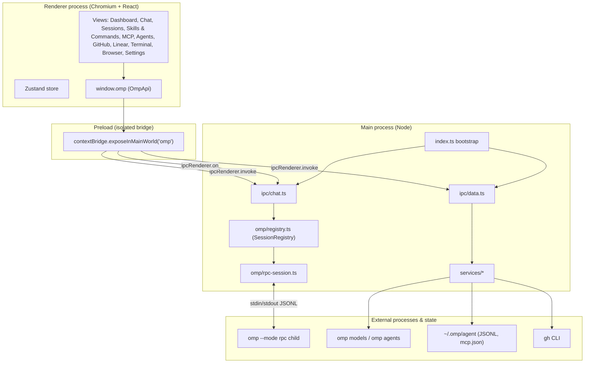
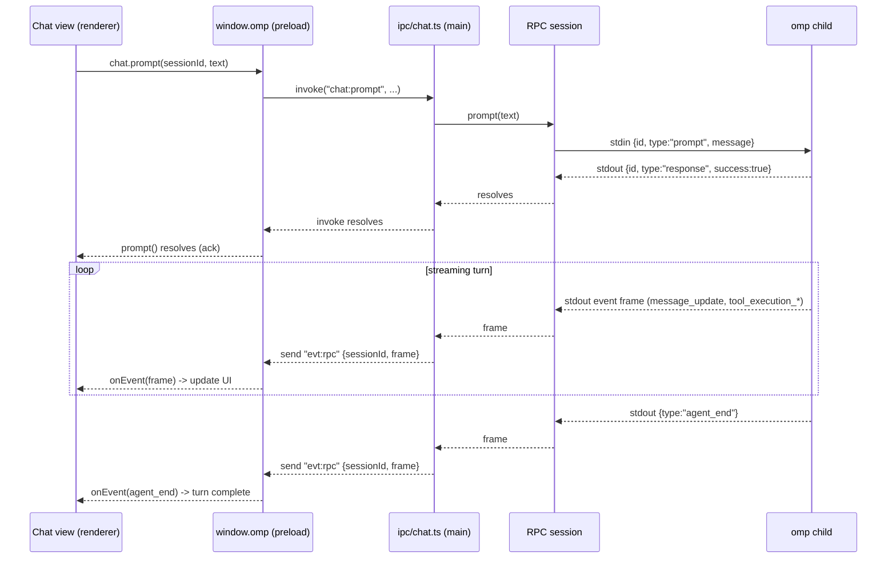

# Architecture

OMP Studio is an Electron desktop client for the Oh My Pi (`omp`) coding-agent
harness. It does not reimplement any agent logic: it drives the real `omp`
binary over its RPC protocol, reads `omp`'s on-disk state, and shells out to the
GitHub CLI. This document describes how the pieces fit together.

## Process model

The app uses the standard Electron three-process model, plus the external
processes it controls.

- **Renderer** — a React 18 application. It is sandboxed from Node and Electron
  and communicates with the backend exclusively through the typed `window.omp`
  object. Routing between views is driven by a Zustand store.
- **Preload** — `src/preload/index.ts`. Runs with context isolation and exposes
  a single frozen `OmpApi` implementation on `window.omp`. Every method is a thin
  forwarder to `ipcRenderer.invoke` (request/response) or `ipcRenderer.on`
  (event subscriptions), keyed by the channel constants in `CH`.
- **Main** — `src/main/index.ts` creates the `BrowserWindow`, registers the data,
  chat, settings, Linear, terminal, and browser IPC handlers, and owns the
  `SessionRegistry`, `TerminalRegistry`, and `BrowserViewManager`. It is the only
  process that touches the filesystem, spawns child processes (`omp`, `gh`, and
  pty shells), talks to `gh` and the Linear API, and hosts the embedded
  `WebContentsView` browser. All three registries are disposed on
  `window-all-closed` and `before-quit`.
- **External** — the `omp` binary (run as a long-lived `--mode rpc` child for
  chat, and one-shot for `omp models` / `omp agents unpack`), the on-disk `omp`
  agent state, the `gh` CLI, the Linear GraphQL API over HTTPS, per-terminal pty
  shells, and the sandboxed embedded browser's remote content.

`src/main/paths.ts` centralizes process boundaries with the host: `ompBinary()`
and `ghBinary()` probe common install locations (and honor the `OMP_BINARY`
override) so packaged apps with a minimal `PATH` still find their tools;
`agentDir()`, `sessionsDir()`, and `mcpConfigPath()` resolve the `omp` state
locations (honoring `PI_CODING_AGENT_DIR`); and `augmentedEnv()` builds a `PATH`
for spawned subprocesses.

## The RPC protocol bridge

Chat is the one area where the main process holds long-lived state. Each chat
session corresponds to a dedicated `omp --mode rpc --cwd <dir>` child process,
created and tracked by `SessionRegistry` (`src/main/omp/registry.ts`) and driven
by a session wrapper (`src/main/omp/rpc-session.ts`).

The protocol is newline-delimited JSON (JSONL) over the child's stdio:

- **Startup.** The bridge spawns the child and waits for the first stdout frame,
  `{"type":"ready"}`, before reporting the session ready.
- **Commands (bridge → child, on stdin).** Each command is one JSON object with
  an optional `id`, for example `prompt` `{message, images?, streamingBehavior?}`,
  `steer`, `follow_up`, `abort`, `get_state`, `get_messages`, `set_model`
  `{provider, modelId}`, `set_thinking_level` `{level}`, `get_subagents`,
  `get_subagent_messages`, `set_subagent_subscription`, and
  `get_available_commands`.
- **Responses (child → bridge, on stdout).** A frame with `type:"response"`
  echoes the originating command `id` and carries `success` plus `data` or
  `error`. The bridge matches responses to pending commands by `id`.
- **Events (child → bridge, on stdout).** Frames without an `id` stream agent
  activity: `agent_start`, `agent_end`, `turn_start`/`turn_end`,
  `message_start`/`message_update`/`message_end`, `tool_execution_start`/
  `update`/`end`, `subagent_lifecycle`/`progress`/`event`,
  `available_commands_update`, and others. `message_update` carries both
  incremental `assistantMessageEvent` deltas and a full `message` snapshot.
- **Subagent telemetry is on by default.** At `ready` the bridge sends
  `set_subagent_subscription {level:"events"}`, so `subagent_lifecycle`,
  `subagent_progress`, and `subagent_event` frames stream for every session with
  no further request. The renderer reduces them per session into the subagent
  drill-in tree and inspector; `get_subagent_messages {sessionFile, fromByte}`
  tails a live subagent's transcript incrementally (`{entries, messages,
  nextByte, reset}`), and `set_subagent_subscription` is an optional per-session
  cost-control knob.
- **A `prompt` is asynchronous.** It is acknowledged immediately with
  `success:true`; the turn finishes later with an `agent_end` event. While a turn
  is streaming, a further `prompt` must specify `streamingBehavior` of `"steer"`
  or `"followUp"`.
- **Auto-responding to UI requests.** `extension_ui_request` frames would
  otherwise block the agent waiting on interactive UI the desktop app does not
  surface. The bridge replies on stdin with `{type:"extension_ui_response", id,
  ...}` using safe defaults (`{confirmed:false}` for confirms, `{cancelled:true}`
  for selects/inputs/editors) and ignores fire-and-forget UI frames
  (`notify`, `setStatus`, `setWidget`, `setTitle`).
- **Teardown.** Disposing a session closes the child's stdin, on which `omp`
  exits 0. `SessionRegistry.disposeAll()` runs on `window-all-closed` and
  `before-quit` so no orphan processes survive the app.

Every frame the bridge reads is forwarded to the renderer verbatim over the
`evt:rpc` channel (wrapped as `{sessionId, frame}`), and session lifecycle
transitions (`spawning`, `ready`, `exited`, `error`) are pushed over
`evt:lifecycle`. The renderer reconstructs streaming chat state from this frame
stream.

### Chat prompt round-trip

## Data services and their sources

The read-only browsers are backed by services under `src/main/services`, invoked
through `ipc/data.ts`. Each service maps a host source into a domain type from
`src/shared/domain.ts` and degrades gracefully (returning `null`/`[]` rather than
throwing across IPC) when a source is missing.

| Service | Source | Domain output |
| --- | --- | --- |
| Dashboard | aggregate of the services below | `DashboardData` |
| Sessions | `~/.omp/agent/sessions/<slug>/<ts>_<uuid>.jsonl` | `SessionSummary[]`, `SessionTranscript` |
| MCP servers | `~/.omp/agent/mcp.json` + project `./.mcp.json` | `McpServerInfo[]` |
| Skills | project + user `.agents`/`.agent`/`.claude` skill dirs, the bundled workflow-kit, and `~/.omp/agent/managed-skills` | `SkillInfo[]` |
| Agents | `omp agents unpack --json` (temp dir) + user/project `*.md` | `AgentInfo[]` |
| Models | `omp models --json` (parsed from the first `{`) | `ModelInfo[]` |
| Providers | grouped from the model catalog | `ProviderInfo[]` |
| GitHub | `gh repo/issue/pr/repo list --json ...` | `GhRepo`, `GhIssue[]`, `GhPr[]` |
| Linear | Linear GraphQL API over HTTPS (main process only) | `LinearStatusInfo`, `LinearTeam[]`, `LinearProjectInfo[]`, `LinearIssue[]` |

Session JSONL is line-oriented: the first line is a `{type:"session", ...}`
header, followed by `{type:"message", message:OmpMessage}` records and metadata
records such as `model_change` and `thinking_level_change`. Model output from
`omp models --json` is preceded by extension warnings on stdout, so the parser
seeks the first `{` before decoding. Agent discovery unpacks bundled agents to a
temporary directory, reads their `---` frontmatter (`name`, `description`,
`model`, `spawns`), and cleans the directory up.

### Stateful main-process subsystems (v2)

Beyond the read-only data services, the main process owns three stateful v2
subsystems and a secret store. Like the data services, they live entirely in
main, are reached only over typed IPC, and degrade instead of throwing.

| Module | Backing | Notes |
| --- | --- | --- |
| `services/secret-store.ts` | Electron `safeStorage` (OS keychain; no `keytar`) | Generic get/set/clear; writes ciphertext to `<userData>/secrets/<name>.bin` (0600). When OS encryption is unavailable it keeps the value in memory for the session only — never plaintext on disk. Backs the Linear API key. |
| `terminal/` | `node-pty` (`TerminalRegistry` + `PtySession`) | One `IPty` per terminal id; cross-platform login shell; concurrency-capped; off by default. `node-pty` loads lazily, so a missing native addon never breaks startup. Mirrors `SessionRegistry`; `disposeAll()` on quit. |
| `browser/` | Electron `WebContentsView` (`BrowserViewManager`) | One isolated `WebContents` per browser tab, positioned by main over a renderer-reported rect; off by default. `destroyAll()` on quit. |

The Linear service (`services/linear.ts`) performs all HTTP from main over
Node's global `fetch` against `https://api.linear.app/graphql` (10 s timeout, no
retry); the renderer never touches the network or the API key. The key reaches
the plain-node service through an injected getter so the service never imports
Electron; the `safeStorage`-backed secret store is wired only in
`ipc/linear.ts`.

## Settings, workspaces, and project root

Studio settings are owned by `services/settings-service.ts`, persisted under
`<userData>` and exposed over `settings:get` / `settings:update`. The schema is
versioned: **v2** is an additive bump over v1 (`migrate()` upgrades a v1 file by
filling defaults). Every new field is optional so a v1 file and any partial
patch stay valid: `workspaces`, `layout`, `ui`, plus `linear`, `terminal`, and
`browser` blocks. Defaults are secure — `terminal.enabled`, `browser.enabled`,
and `linear.writesEnabled` are all `false`. `mergeKnown()` copies only known
keys and explicitly drops token-shaped data, so the **Linear API key never lands
in settings JSON** (it lives in the keychain via `secret-store.ts`); `linear`
here holds non-secret metadata only (`writesEnabled`, `defaultTeamId`).

**Workspaces** are the v2 first-class project model that supersedes the v1
`recentProjects` log: `settings.workspaces` is a list of
`{id, cwd, label, pinned, lastUsedAt}` entries the renderer manages (switcher,
add dialog, Settings panel). Selecting a workspace only re-targets new chats at
its `cwd`; live sessions keep their own `cwd`, and switching spawns nothing.

The active workspace `cwd` also fixes a v1 bug: project-scoped discovery
(`listSkills`, `listMcpServers`, `listAgents`, and the dashboard aggregate) used
`process.cwd()`, which in a packaged app is the launch directory (often `/`),
not the user's project. These reads now take an optional `cwd` threaded from the
active workspace, falling back to the most-recently-active chat session's `cwd`
when no workspace is set (`activeSessionCwd()` in `index.ts`).

## The shared type contract

`src/shared` is the single source of truth shared by all three processes and is
treated as frozen:

- **`rpc.ts`** — the `omp` RPC protocol surface: `ThinkingLevel`, the
  message/content-block model (`OmpMessage`, `ContentBlock`, `TextBlock`,
  `ThinkingBlock`, `ToolCallBlock`), `RpcState`, `RpcFrame` and its refinements
  (`MessageUpdateFrame`, `ToolExecutionFrame`, `AgentEndFrame`), `AvailableModel`,
  `SubagentInfo`, and todo types. v2 adds typed subagent telemetry
  (`SubagentSubscriptionLevel`, `AgentProgress`, `SubagentSnapshot`, the
  `SubagentLifecycle`/`Progress`/`Event` frame refinements,
  `SubagentMessagesResult`) and the commands-palette types
  (`AvailableSlashCommand`, `AvailableCommandSource`).
- **`domain.ts`** — app-level read-only types surfaced in the browsers:
  `SessionSummary`, `SessionTranscript`, `McpServerInfo`, `SkillInfo` (whose
  `source` now also covers `claude` and `managed` skills), `AgentInfo`,
  `ProviderInfo`, `ModelInfo`, the GitHub types, and the `DashboardData`
  aggregate, plus the v2 integration types (`LinearStatusInfo`, `LinearViewer`,
  `LinearTeam`, `LinearProjectInfo`, `LinearIssue`, `TerminalInfo`,
  `BrowserViewState`).
- **`ipc.ts`** — the channel map `CH` and the `OmpApi` interface that the preload
  implements and the renderer consumes, plus the chat payload types
  (`ChatCreateOptions`, `PromptOptions`, `ChatRpcEvent`, `ChatLifecycleEvent`) and
  the persisted settings shapes (`StudioSettingsV1`, the additive
  `StudioSettingsV2` with `Workspace`/`LayoutSettings`/`UiPrefs`, and the
  `StudioSettings` alias).

Because the preload, main handlers, and renderer all import the same definitions,
the IPC surface stays in lockstep and is checked by `npm run typecheck` (separate
`tsconfig.node.json` and `tsconfig.web.json` projects). Path aliases:
`@shared/*` resolves to `src/shared/*` in every process, and `@/*` resolves to
`src/renderer/src/*` in the renderer only.

## IPC channel map (`CH`)

All channel names are defined once in `src/shared/ipc.ts` as `CH`. They divide
into request/response channels (handled with `ipcMain.handle` /
`ipcRenderer.invoke`) and event channels (main → renderer pushes).

**Read-only data (`data:*`)**

| `CH` key | Channel | Purpose |
| --- | --- | --- |
| `dashboard` | `data:dashboard` | Aggregate dashboard payload |
| `listSessions` | `data:sessions:list` | Session summaries |
| `readSession` | `data:sessions:read` | One session transcript |
| `listMcp` | `data:mcp:list` | MCP servers |
| `listSkills` | `data:skills:list` | Skills |
| `listAgents` | `data:agents:list` | Bundled/discovered agents |
| `listModels` | `data:models:list` | Model catalog |
| `listProviders` | `data:providers:list` | Providers + auth status |
| `pickDirectory` | `data:pickDirectory` | Native directory picker |
| `openExternal` | `data:openExternal` | Open a URL in the OS browser |
| `searchSessions` | `data:searchSessions` | Transcript search hits |

**GitHub (`gh:*`)**

| `CH` key | Channel | Purpose |
| --- | --- | --- |
| `ghCurrentRepo` | `gh:currentRepo` | Current repository (or null) |
| `ghListRepos` | `gh:repos` | Owned repositories |
| `ghListIssues` | `gh:issues` | Issues |
| `ghListPrs` | `gh:prs` | Pull requests |

**Chat request/response (`chat:*`)**

| `CH` key | Channel | Purpose |
| --- | --- | --- |
| `chatCreate` | `chat:create` | Spawn an `omp` RPC session |
| `chatPrompt` | `chat:prompt` | Send a prompt |
| `chatSteer` | `chat:steer` | Steer the active turn |
| `chatFollowUp` | `chat:followUp` | Queue a follow-up |
| `chatAbort` | `chat:abort` | Abort the active turn |
| `chatSetModel` | `chat:setModel` | Change model |
| `chatSetThinking` | `chat:setThinking` | Change thinking level |
| `chatGetState` | `chat:getState` | Fetch session state |
| `chatGetMessages` | `chat:getMessages` | Fetch session messages |
| `chatGetSubagents` | `chat:getSubagents` | List subagents |
| `chatDispose` | `chat:dispose` | Tear down the session |
| `chatList` | `chat:list` | List open-session descriptors |
| `chatResume` | `chat:resume` | Resume a session from its JSONL path |
| `chatClose` | `chat:close` | Dispose the live child (keeps transcript) |
| `chatRespondUi` | `chat:uiRespond` | Renderer reply to a UI request |
| `chatGetSessionStats` | `chat:getSessionStats` | Token/cost/context stats |
| `chatCompact` | `chat:compact` | Compact the transcript |
| `chatSetSubagentSubscription` | `chat:setSubagentSubscription` | Set per-session subagent telemetry level |
| `chatGetSubagentMessages` | `chat:getSubagentMessages` | Tail a live subagent's transcript |
| `chatGetAvailableCommands` | `chat:getAvailableCommands` | Snapshot available slash commands |

**Session actions (`data:sessions:*`, mutating)**

| `CH` key | Channel | Purpose |
| --- | --- | --- |
| `sessionRename` | `data:sessions:rename` | Rename a session title |
| `sessionDelete` | `data:sessions:delete` | Move a session to the OS trash |
| `sessionArchive` | `data:sessions:archive` | Archive / unarchive a session |
| `sessionReveal` | `data:sessions:reveal` | Reveal the JSONL file in the host |
| `sessionExportHtml` | `data:sessions:exportHtml` | Export a session to HTML |

**Settings (`settings:*`)**

| `CH` key | Channel | Purpose |
| --- | --- | --- |
| `settingsGet` | `settings:get` | Read persisted studio settings |
| `settingsUpdate` | `settings:update` | Merge a settings patch |

**Linear (`linear:*`)** — all HTTP happens in the main process

| `CH` key | Channel | Purpose |
| --- | --- | --- |
| `linearStatus` | `linear:status` | Auth status + viewer |
| `linearSetApiKey` | `linear:setApiKey` | Validate + store the API key |
| `linearClearApiKey` | `linear:clearApiKey` | Delete the stored key |
| `linearListTeams` | `linear:teams` | Teams |
| `linearListProjects` | `linear:projects` | Projects |
| `linearListIssues` | `linear:issues` | Issues |
| `linearGetIssue` | `linear:issue` | One issue |
| `linearCreateIssue` | `linear:createIssue` | Create an issue (gated by `writesEnabled`) |
| `linearUpdateIssue` | `linear:updateIssue` | Update an issue (gated by `writesEnabled`) |
| `linearCreateComment` | `linear:createComment` | Comment on an issue (gated by `writesEnabled`) |

**Terminal (`terminal:*`)** — disabled by default

| `CH` key | Channel | Purpose |
| --- | --- | --- |
| `terminalCreate` | `terminal:create` | Spawn a pty shell |
| `terminalWrite` | `terminal:write` | Write input to a pty |
| `terminalResize` | `terminal:resize` | Resize a pty |
| `terminalKill` | `terminal:kill` | Kill a pty |
| `terminalList` | `terminal:list` | List live terminals |

**Embedded browser (`browser:*`)** — disabled by default

| `CH` key | Channel | Purpose |
| --- | --- | --- |
| `browserCreate` | `browser:create` | Create an isolated browser view |
| `browserNavigate` | `browser:navigate` | Navigate to a URL |
| `browserGoBack` | `browser:goBack` | Go back |
| `browserGoForward` | `browser:goForward` | Go forward |
| `browserReload` | `browser:reload` | Reload |
| `browserSetBounds` | `browser:setBounds` | Position the view over the renderer rect |
| `browserDestroy` | `browser:destroy` | Destroy the view |

**Events (main → renderer)**

| `CH` key | Channel | Payload |
| --- | --- | --- |
| `evtRpc` | `evt:rpc` | `{sessionId, frame}` — forwarded RPC frames |
| `evtLifecycle` | `evt:lifecycle` | `{sessionId, status, detail?}` |
| `evtUiRequest` | `evt:ui-request` | `{sessionId, request, responseRequired}` |
| `evtTerminalData` | `evt:terminal-data` | `{id, data}` — pty output |
| `evtTerminalExit` | `evt:terminal-exit` | `{id, code}` — pty exit |
| `evtBrowserState` | `evt:browser-state` | `BrowserViewState` — embedded view state |

## Security notes

- **Context isolation is on.** The `BrowserWindow` is created with
  `contextIsolation: true`, so the renderer's JavaScript context is separated
  from the preload and Electron internals. The preload uses
  `contextBridge.exposeInMainWorld` to publish only the curated `OmpApi`; the
  renderer has no access to `ipcRenderer`, `require`, or Node built-ins.
- **No remote content.** The renderer only ever loads the local bundle (the dev
  server URL in development, the built `index.html` in production). External
  navigations are denied via `setWindowOpenHandler`, which routes URLs to the OS
  browser through `shell.openExternal` instead of opening them in-app.
- **Content Security Policy.** `index.html` ships a restrictive CSP:
  `default-src 'self'`, `script-src 'self'` (no inline or remote scripts),
  `connect-src 'self'`, with `img-src` limited to `self`, `data:`, and `https:`.
- **The renderer cannot reach the host directly.** Filesystem access, subprocess
  spawning (`omp`, `gh`), and shell commands all live in the main process behind
  the typed IPC surface. Data services never throw across the IPC boundary;
  missing tools or unauthenticated CLIs degrade to empty/null results.
- **Child-process hygiene.** RPC sessions (`SessionRegistry`), pty terminals
  (`TerminalRegistry`), and embedded browser views (`BrowserViewManager`) are all
  tracked and disposed on `window-all-closed` and `before-quit`, so no `omp`
  child, shell, or remote-content view outlives the app.
- **Secrets stay out of settings.** The Linear API key is stored as OS-keychain
  ciphertext via Electron `safeStorage` (`secret-store.ts`), never in the
  settings JSON. All Linear HTTP runs in the main process, so the renderer's
  `connect-src 'self'` is never relaxed and the renderer never sees the key or
  the network; issue/comment writes are off by default
  (`settings.linear.writesEnabled`).
- **The terminal is a real shell, off by default.** When
  `settings.terminal.enabled` is set, `terminal:create` spawns a pty
  (`node-pty`) running the user's login shell at full user privilege — the
  largest capability in the app. Input reaches a pty only from the local
  terminal view; agent output, RPC frames, and remote content are never written
  to a pty. The pty is main-owned (the renderer holds no process handle),
  concurrency-capped, spawned only in a validated `cwd`, and killed on quit. The
  UI never claims the terminal is "safe" — enabling it means the app can run
  anything the user can.
- **The embedded browser is isolated, off by default.** When
  `settings.browser.enabled` is set, each browser tab is a separate
  `WebContentsView` with its own `WebContents` — `sandbox:true`,
  `contextIsolation:true`, `nodeIntegration:false`, and **no preload** — so
  remote content cannot reach `window.omp`, `ipcRenderer`, or Node. It uses an
  ephemeral in-memory session partition by default (cookies/cache discarded on
  exit; a persisted partition is an explicit opt-in), main polices navigation
  (`http`/`https` only, `window.open` denied or routed to `openExternal`, with an
  optional host allowlist), and the view has no IPC bridge. Crucially, **the main
  renderer's CSP is unchanged** (`default-src`/`script-src`/`connect-src
  'self'`); the embedded browser is a distinct, deliberately-permissive web
  context, not the privileged renderer.
